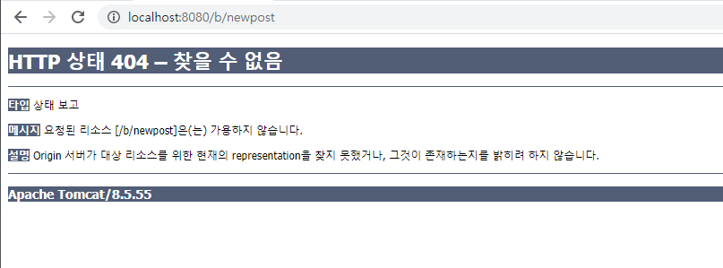
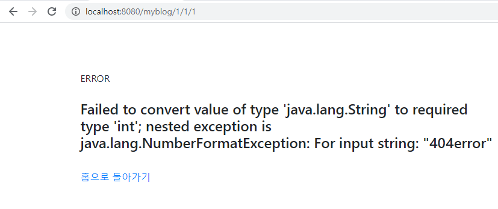

# error & transaction


## error

200 : OK<br>
400 : Bad Request<br>
404 : Not Found<br>
500 : Internal Server Error


### web.xml에서 처리하기
```xml
<error-page>
	<error-code>404</error-code>
	<location>/error/404error</location>
</error-page>
```

controller 만들어서 view로 보내준다.

### spring에서 예외처리하기
1. @ExceptionHandler
	:RequestMapping대신 ExceptionHandler 어노테이션 사용
```java
@ExceptionHandler(RuntimeException.class)
public String exceptionHandler(Model model, Exception exception){

	...

	return "error/filename";
}
```
2. @ControllerAdvice
	:예외처리 전용 컨트롤러 생성
```java
@ControllerAdvice
public class ExceptionAdvice{
	private static final Logger logger = LoggerFactory.getLogger(ExceptionAdvice.class);

	@ExceptionHandler(RuntimeException.class)
	public String errorProcess(Model model, Exception e){
		
		...
		
		reutrn "error/filename"
	}
}
```
3. @ResponseStatus
	: 상세 상태.
	에러처리 우선순위가 @ControllerAdvice가 @ResponseStatus보다 우선이기 때문에 ResponseStatus 사용하려면 ControllerAdvice 주석처리
NotFoundException.java
```java
@ResponseStatus(HttpStatus.NOT_FOUND)
public class NotFoundException extends RuntimeException{

}
```

비즈니스로직(서비스 단)에서
`catch(RuntimeException e){
	throw new NotFoundException();
}`
에러 발생

----------------------------------

## transaction

### 선언적 트랜잭션
tx-context.xml
```xml
<?xml version="1.0" encoding="UTF-8"?>
<beans xmlns="http://www.springframework.org/schema/beans"
	xmlns:xsi="http://www.w3.org/2001/XMLSchema-instance"
	xmlns:tx="http://www.springframework.org/schema/tx"
	xmlns:aop="http://www.springframework.org/schema/aop"
	xsi:schemaLocation="
		http://www.springframework.org/schema/beans 
		http://www.springframework.org/schema/beans/spring-beans.xsd
		http://www.springframework.org/schema/aop 
		http://www.springframework.org/schema/aop/spring-aop.xsd
		http://www.springframework.org/schema/tx 
		http://www.springframework.org/schema/tx/spring-tx.xsd">	

	<!-- Transaction 설정 -->
	<bean id="transactionManager" class="org.springframework.jdbc.datasource.DataSourceTransactionManager">
 		<property name="dataSource" ref="dataSource"/>
 	</bean>

 	 	 	

 	<!-- Transaction을 위한 AOP 설정 -->

 	<aop:config proxy-target-class="true">
 		<!--공통 기능 적용 대상 지정 (pointcut)-->
		<aop:pointcut id="servicePublicMethod" expression="execution(구조 주석 참고)" />
		<!--적용 대상 구조 : public 반환형 패키지 경로 및 클래스명 메소드명 파라미터
			ex) public * com.wakefield.myblog.service..*(int) 라면
				com.wakefield.myblog.service패키지 하위의 모든 패키지 중 int 타입의 파라미터 하나만 가진 클래스 (반환형 상관 없음)-->

		<!--공통 기능 구현체 (advisor)-->
		<aop:advisor advice-ref="txAdvice" pointcut-ref="" />
		<!--advice-ref : 구현체 빈 지정, pointcut-ref : 구현체 적용 대상-->
	</aop:config>

	

	<!-- 선언적 Transaction 설정  -->
	<tx:advice id="txAdvice" transaction-manager="transactionManager">
		<tx:attributes>
			<tx:method name="exmethod" rollback-for="Exception" />
			<!--메소드명, 트랜잭션 발생시의 동작 : exmethod 메소드에서 exception이 발생하면 롤백하겠다는 의미-->
		</tx:attributes>    
 	</tx:advice> 	


</beans>
```

### @Transaction
tx-context.xml
```xml
<?xml version="1.0" encoding="UTF-8"?>
<beans xmlns="http://www.springframework.org/schema/beans"
	xmlns:xsi="http://www.w3.org/2001/XMLSchema-instance"
	xmlns:tx="http://www.springframework.org/schema/tx"
	xmlns:aop="http://www.springframework.org/schema/aop"
	xsi:schemaLocation="
		http://www.springframework.org/schema/beans 
		http://www.springframework.org/schema/beans/spring-beans.xsd
		http://www.springframework.org/schema/aop 
		http://www.springframework.org/schema/aop/spring-aop.xsd
		http://www.springframework.org/schema/tx 
		http://www.springframework.org/schema/tx/spring-tx.xsd">	

	<!-- Transaction 설정 -->
	<bean id="transactionManager" class="org.springframework.jdbc.datasource.DataSourceTransactionManager">
 		<property name="dataSource" ref="dataSource"/>
 	</bean>
 	<tx:annotation-driven/>
 </beans>
```
트랜잭션을 적용할 위치에 @Transactional어노테이션 적용

```java
@Transactional
public int exmethod(int i) throws Exception{
	...
}
```


-----------------------------

오류처리 했는데 



오류 페이지로 안 넘어감. 컨텍스트 path 안 들어가서 그런건가 