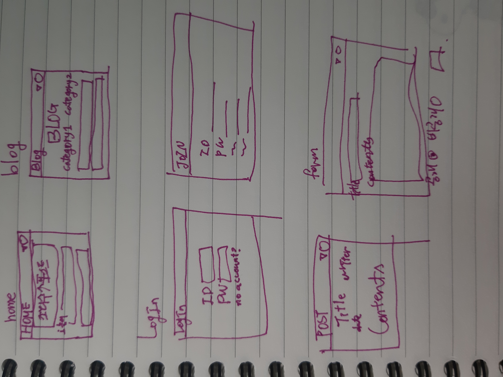
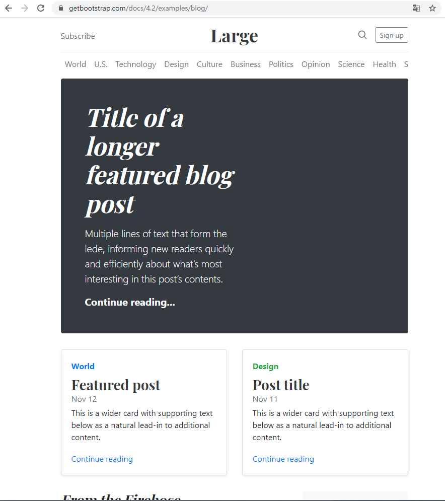

# 화면


화면 구상인척 하는 낙서


https://getbootstrap.com/docs/4.2/examples/blog/


이거 사용.

* form 태그 메소드 put이나 delete로 보내기
`<input type = "hidden" name = "_method" value = "put">`

web.xml
```xml
<filter>
    <filter-name>httpMethodFilter</filter-name>
    <filter-class>org.springframework.web.filter.HiddenHttpMethodFilter</filter-class>
</filter>
<filter-mapping>
    <filter-name>httpMethodFilter</filter-name>
    <url-pattern>/*</url-pattern>
</filter-mapping>
```