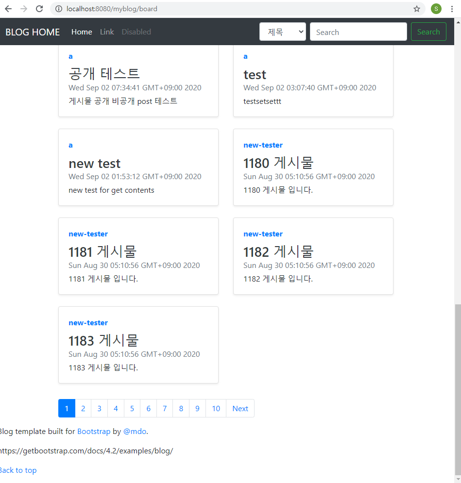
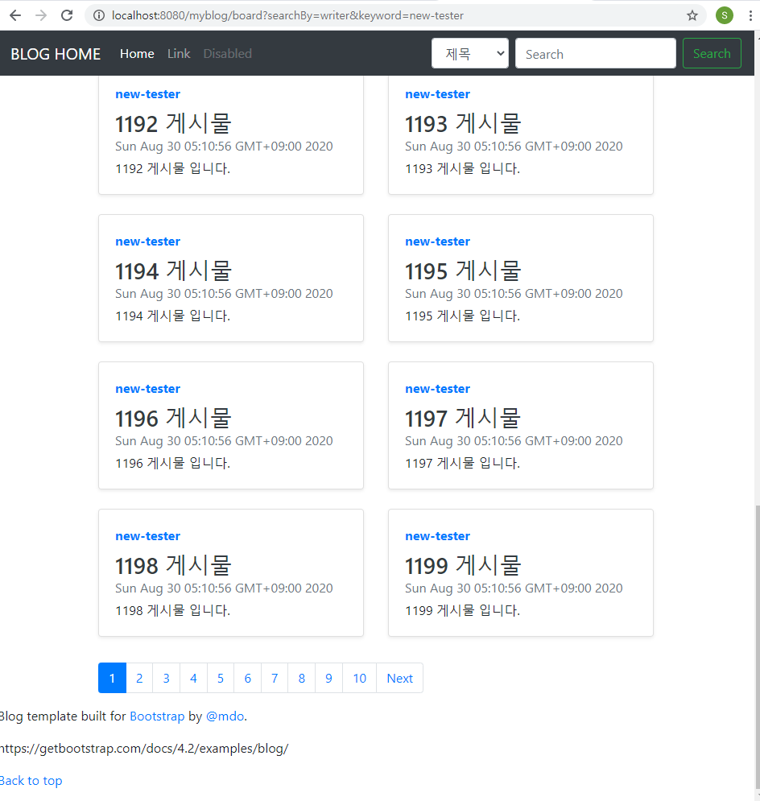

# 페이징 & 검색

```java
    private int curPage;
	private int startPage;
	private int endPage;
	private int totalPostCnt;
	private int totalPageCnt;
	private int pagePostCnt = 20;
	private int pageCnt = 15;
	private boolean prev;
	private boolean next;
	
	/*db위한 변수*/
	private int indexing;
	private int startIndex;
```
curPage: 현재 페이지
startPage: 인덱스 시작 페이지
endPage: 인덱스 끝 페이지
totalPostCnt: 전체 게시물 갯수
totalPageCnt: 전체 페이지 갯수
pagePostCnt: 한 페이지에 있는 게시물 갯수
pageCnt: 페이지 인덱스 갯수
prev, next: 인덱스 이전 이후 값 존재여부

indexing: db에서 rownum index 범위
startIndex: curPage에서 첫 게시물 idx


```xml
<select id = "getBoardList" resultType = "com.wakefield.myblog.model.BoardVO">
		<!-- 
		SELECT * FROM tbl_board WHERE `lock` = 0;
		 -->
		 SELECT A.*
		 FROM(
		 	SELECT @rownum:=@rownum+1 as rownum, tbl_board.*
		 	FROM tbl_board, (select @rownum:=0)R
		 	ORDER BY tbl_board.`date` desc limit #{indexing}
		 )A	
		 WHERE `lock` = 0
		 LIMIT #{startIndex}, #{pagePostCnt};
	</select>
```
* rownum을 찾고자 하는 위치까지만 붙여주기 위해 limit설정했으나 정말 찾고자 하는 위치까지만 붙는가
최신순. 


## 검색


<br>
검색기능 적용 후 기본화면에서 포스트 하나가 덜 보임.


<br>
검색후 결과에는 원하는 수만큼 보임
